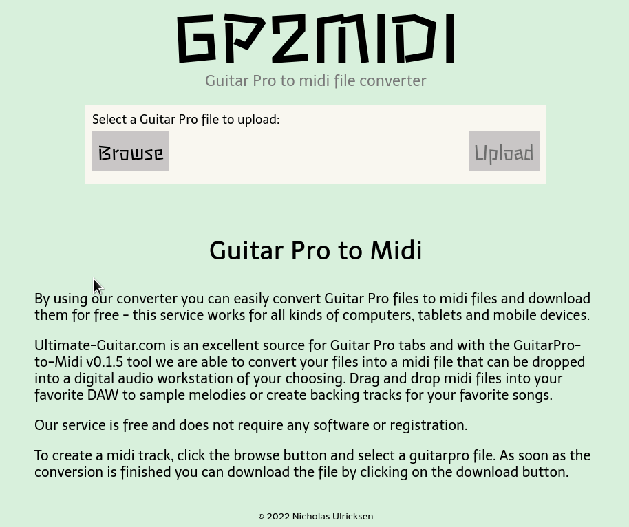

# gp2midi website

Website for gp2midi.com built with React.js and styled-components. 

Convert Guitar Pro files to midi, useful for creating backing/jam tracks.



## Built with

- [React](https://reactjs.org/)
- [styled-components](https://styled-components.com/)

## Installation

[Node.js](https://nodejs.org/) and [yarn](https://yarnpkg.com/) are required to run 
this project locally. 

Clone the repo:

```sh
git clone https://github.com/n-ulricksen/gp2midi-web
cd gp2midi-website
```

Install dependencies:

```sh
yarn
```

## Usage

To run development server:

```sh
yarn start
```

To build static assets (to `public/`):

```sh
yarn build
```

Check out the running application at

```
localhost:3000
```

## Contributing

Pull requests welcome and appreciated!

## License

[MIT](https://choosealicense.com/licenses/mit/)

